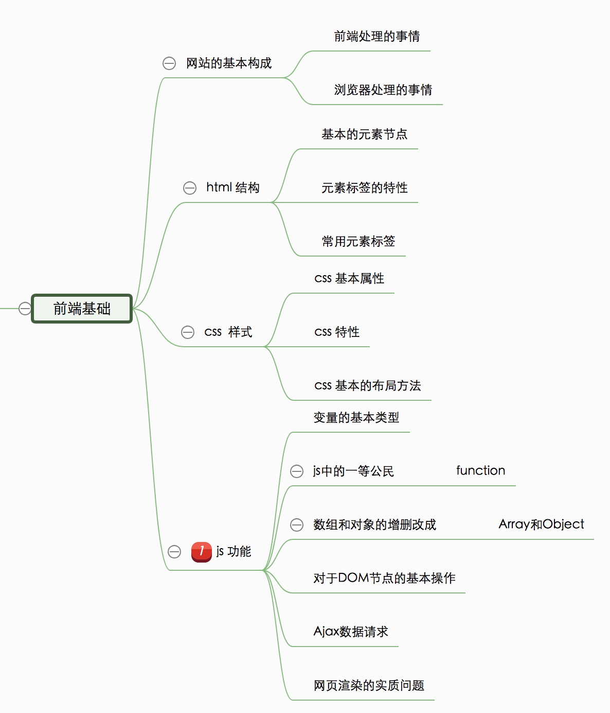

# 前端

源文件下载 https://github.com/HerryLo/lesson

个人邮箱 13995578046@163.com

Mark

## 前端基础

### 课程目录

- [前端基础知识](./baseLesson/lesson1.md)
- html
    - [html基本的元素节点](./baseLesson/lesson2/lesson2.md)
        - [示例1](./baseLesson/lesson2/lesson23.html)
    - [html常用节点和特性](./baseLesson/lesson3/lesson3.md)
        - [示例2](./baseLesson/lesson3/lesson33.html)
    - [css样式](./baseLesson/lesson4/lesson4.md)
        - [示例2](./baseLesson/lesson4/lesson44.html)
    - [js变量](./baseLesson/lesson5/lesson5.md)
        - [示例1](./baseLesson/lesson5/lesson55.html)
    - [DOM节点操作](./baseLesson/lesson6/lesson6.md)
        - [示例1](./baseLesson/lesson6/lesson66.html)